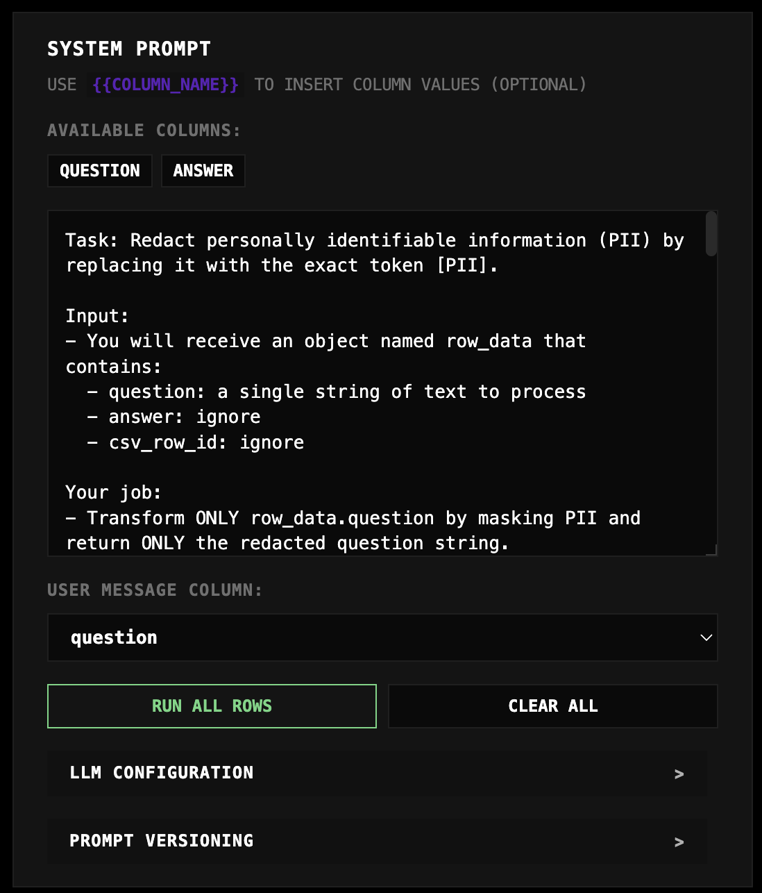
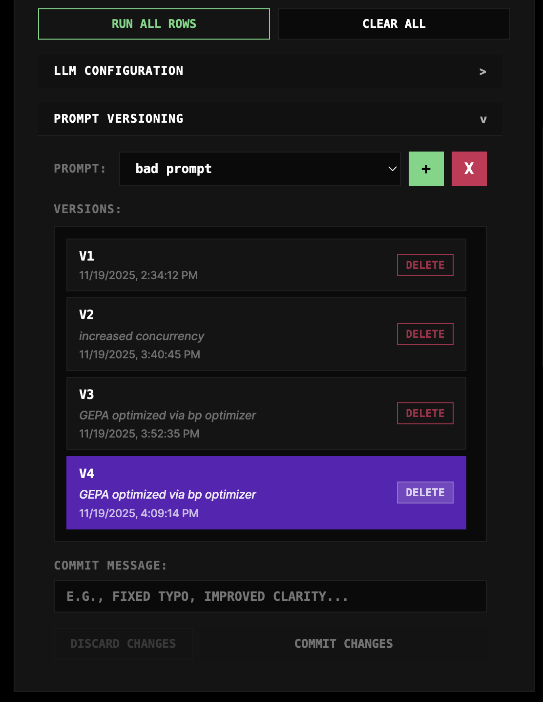
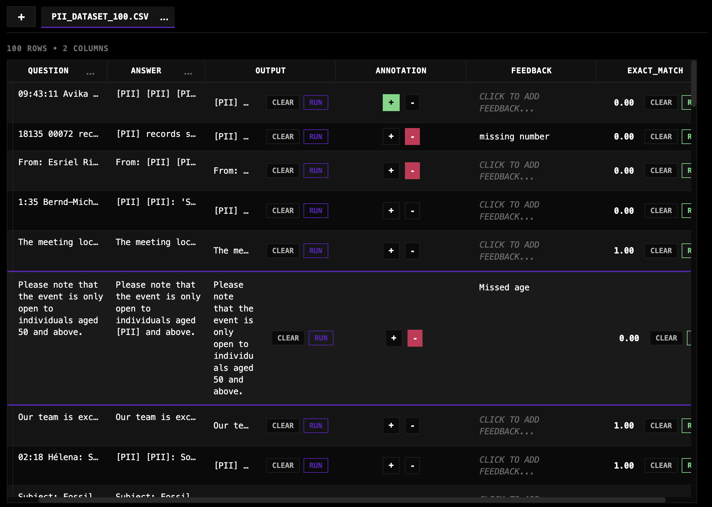
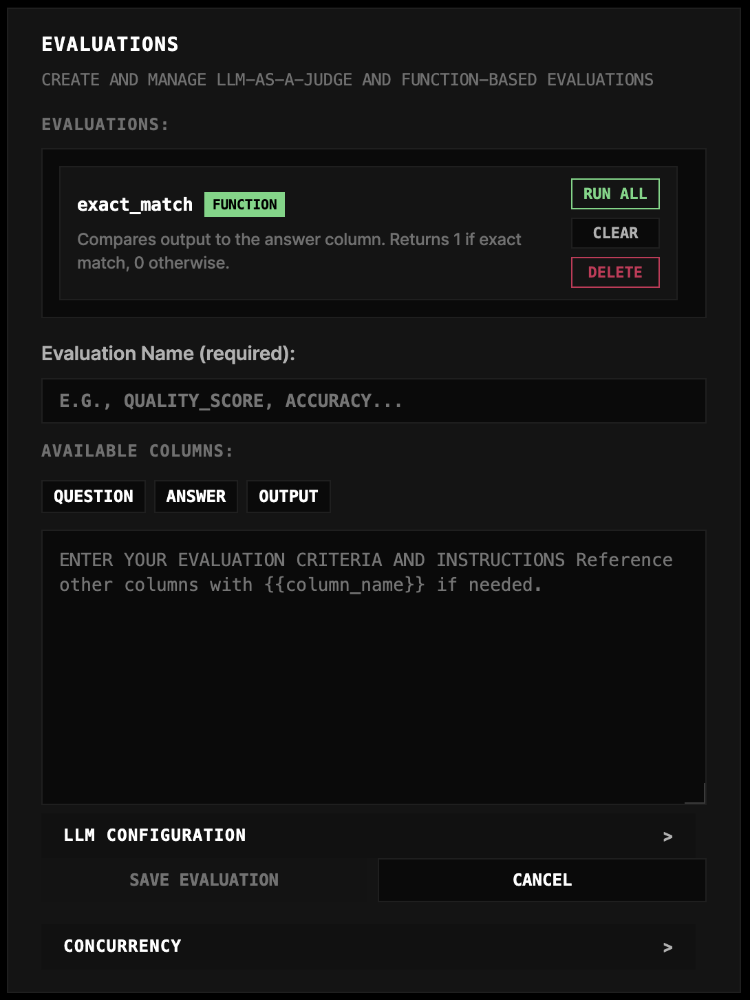
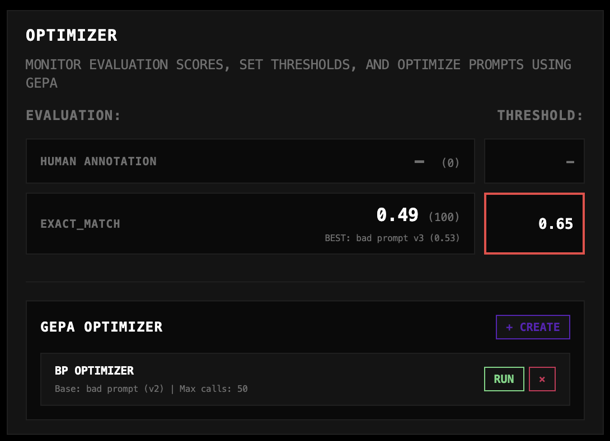

# Evaluizer


Evaluizer is a lightweight interface for evaluating and optimizing LLM prompts. It allows you to iterate on prompts, visualize outputs against datasets, manually annotate results, and run automated evaluations using both LLM judges and deterministic functions. It features **GEPA** (Genetic-Pareto), an optimization engine that evolves your prompts to maximize evaluation scores.

## Install

Evaluizer consists of a Python/FastAPI backend and a React frontend.

### Backend

The backend uses `uv` for dependency management.

```bash
cd backend

# Install dependencies
uv sync

# Run the server
uv run fastapi dev app/main.py
```

### Frontend

The frontend is a Vite React app.

```bash
cd frontend
npm install
npm run dev
```

## Usage

### Uploading Data
Start by uploading a CSV file containing your dataset. The columns in your CSV will be available as variables for your prompts.

### Creating Prompts



Use the **Prompt Editor** to configure the **System Prompt** and select a column to serve as the **User Message**. You can define variables in the system prompt using mustache syntax (e.g., `{{variable}}`) which will be populated from your CSV columns.

### Prompt Versioning and Config



Evaluizer automatically versions your prompts. You can view the history of changes, revert to previous versions, and manage configuration settings for the generator model (e.g., temperature, max tokens).

### Visualizing



The **Data Table** view allows you to see your CSV dataset alongside the generated outputs from your prompts. You can compare outputs across different prompt versions.

### Evals



Evaluizer supports three types of evaluations:

#### Annotating (Human Eval)
You can manually review generated outputs by providing:
- **Binary Feedback**: Thumbs up (1) or Thumbs down (0).
- **Text Feedback**: Detailed notes on why an output was good or bad.

*Note: Currently, human annotations are not used as a signal for the GEPA optimizer.*

#### Making LLM as a Judge Evals
Configure "Judge" prompts that act as evaluators. These judges take the input, the generated output, and their own system prompt to produce a score.

#### Making Function Evals
For deterministic scoring, you can use Python-based function evaluations. These are implemented as plugins in the `evaluations/` directory.
(See `evaluations/README.md` for details on creating custom plugins).

### Optimizing



#### What is GEPA?
**GEPA** (Genetic-Pareto) is an evolutionary optimization algorithm based on [Reflective Prompt Evolution](https://arxiv.org/abs/2507.19457). It uses a reflective approach where it:
1. Generates outputs using the current prompt.
2. Evaluates them using your configured Judges and Function Evals.
3. Reflects on the feedback to propose improved prompt variations.
4. Iteratively evolves the prompt to maximize the combined score.

#### Config and Recs
To run GEPA, you need:
1. A **Base Prompt** to start from.
2. A **Dataset** (CSV) for training and validation.
3. **Evaluation Signals** (at least one Judge or Function Eval) to define what "good" looks like.

Configure the optimization parameters (max iterations, reflection model) in the Optimizer Panel.

## Contributing

Contributions welcome! Feel free to submit a PR.

Todo list:
- 

## License

[MIT](LICENSE)
